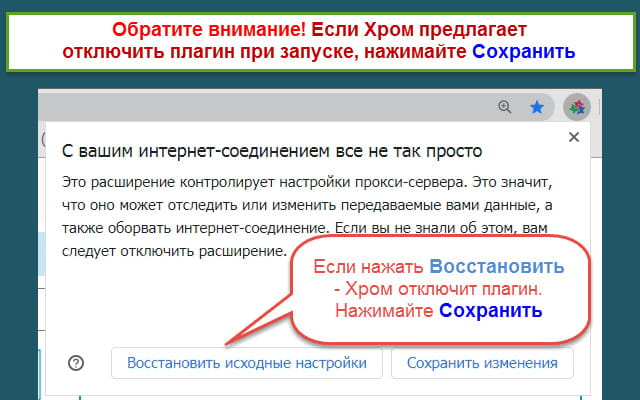
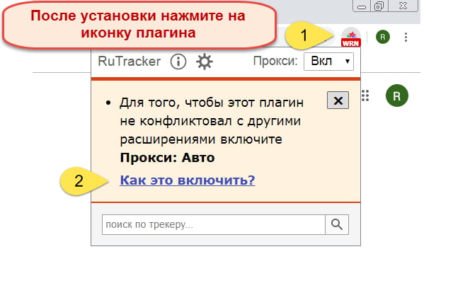
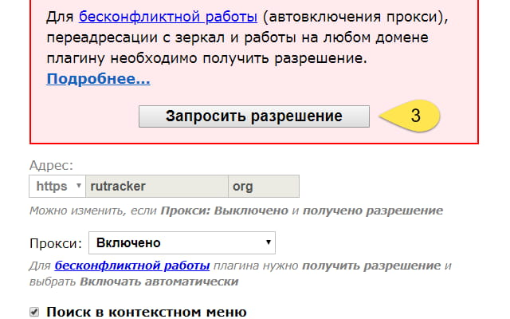
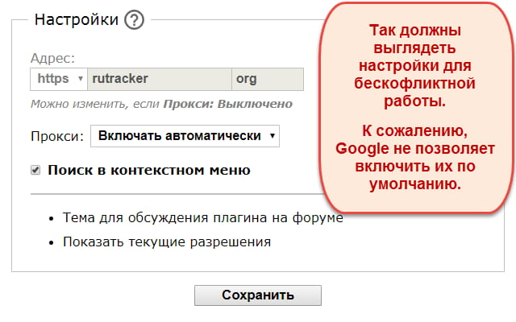
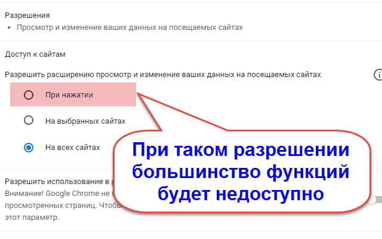

# RuTracker

## Расширение для браузера

[Плагин для браузеров на Chromium](https://chrome.google.com/webstore/detail/fddjpichkajmnkjhcmpbbjdmmcodnkej?nt)

[Плагин для Firefox](https://addons.mozilla.org/en-US/firefox/addon/rutracker-add-on/?nt) (версия браузера 56>=)

## FAQ





### Какой вариант выбрать для опции Прокси?

- Если у вас сайт **не заблокирован**, выберите **Выключено**.
- Если заблокирован, но при этом вы **не используете** другие плагины для обхода блокировок, выберите **Включено**.
- Если заблокирован и вы **используете** другие плагины для обхода блокировок, выберите **Автоматически**.

### У меня уже установлены плагины для других сайтов, будут ли они работать после установки этого плагина и не будут ли другие мешать этому?

С этим чаще всего не должно быть проблем, так как в плагине предусмотрен *бесконфликтный режим*. Правда, к сожалению, некоторые плагины начали вести себя крайне агрессивно по отношению к другим и теперь это не всегда срабатывает.

### Что такое бесконфликтный режим и как его включить?

Эта проблема актуальна для Хрома, где только один плагин, установленный последним, может контролировать необходимые настройки браузера. Чтобы решить эту проблему, был добавлен бесконфликтный режим.

Нужно выбрать в настройках - **Прокси: Включать автоматически**

После этого плагин будет включаться только в случае необходимости и не мешать другим плагинам. Если потом вы установите другой конфликтный плагин, будут показаны предупреждение и инструкция по устранению возникшего конфликта.

### Зачем нужно еще раз запрашивать разрешение?

Начиная с июня 2019 года, Хром изменил требования и некоторые разрешения больше невозможно получить в момент установки.

Браузер требует от разработчиков предварительного объяснения, для чего именно нужны эти разрешения. После установки рекомендуем вам открыть страницу с настройками (см. скриншоты).

Там подробно расписано, для чего нужно получить разрешение. Обратите внимание, что без получения необходимых разрешений нормальная работа плагина невозможна.

В случае обнаружения проблем (не предоставлено разрешение или обнаружен конфликт), плагин изменит иконку (см. скриншоты).





### Есть ли плагин для Android?

Плагин совместим с Firefox 67+ (настройки могут не работать, но сайт доступен). Однако, Firefox похоже имеет баг и сразу после установки плагин не всегда работает (в чем причина - пока не выяснили). Требуется перезапуск телефона или планшета.

### Плагин неожиданно сам по себе отключился. Что происходит?

Сам по себе плагин отключаться не должен.

Однако известно, что некоторые расширения ведут себя крайне агрессивно и могут отключать по своему усмотрению любые установленные у вас плагины. Возможно, вы установили именно такое.

Для восстановления функционирования отключенного плагина обычно достаточно открыть вкладку управления расширениями и заново его включить.

### Будет ли плагин для браузера Opera?

Мы пытались добавить плагин в магазин Оперы. Но после того, как он провисел в ожидании модерации 2 месяца, мы от этих попыток отказались и пока не планируем снова тратить на это время.


**Важно!** 
Речь идет о Opera, которая использует движок Presto. OperaGX использует Chromium.


### Будет ли плагин для браузера Safari?

Пока нет.
